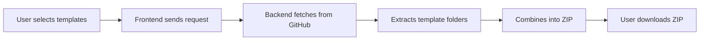

# 🚀 Zero-Config Full-Stack Starter Generator

**Instantly generate production-ready full-stack projects without manual setup!**

A powerful web-based generator that creates fully configured MERN/MEAN/PERN stack projects with TypeScript, authentication, and best practices — all in one click.


---

## 🎯 What Is This?

**Zero-Config** eliminates the tedious hours spent setting up boilerplate code for full-stack projects. Instead of manually configuring TypeScript, bundlers, databases, authentication, and folder structures, simply: 

1. **Select** your frontend framework (React or Angular)
2. **Select** your backend framework (Express.js or NestJS)
3. **Download** a fully configured, production-ready project
4. **Start coding** immediately! 

Perfect for: 
- 🚀 Rapid prototyping
- 📚 Learning full-stack development
- 🏗️ Bootstrapping new projects
- 🎓 Teaching and tutorials
- 🏆 Hackathons and MVPs

---

## ✨ Available Stack Combinations

### 🎨 **Frontend Options**

#### ⚛️ **React + Vite + TypeScript**
- Modern React 18+ with Vite bundler
- TypeScript for type safety
- JWT authentication with Context API
- Protected routes with React Router
- Automatic token refresh mechanism
- Beautiful UI with responsive design
- ESLint + Prettier configuration

#### 🅰️ **Angular (Latest)**
- Angular 21+ with standalone components
- TypeScript strict mode
- Signal-based state management
- JWT authentication service
- HTTP interceptors for auth
- Angular Router with guards
- Modern standalone API
- Vitest for unit testing

---

### 🔧 **Backend Options**

#### 🚀 **Express. js + MongoDB + TypeScript**
- Express 5.x with TypeScript
- MongoDB with Mongoose ODM
- JWT authentication (Access + Refresh tokens)
- In-memory MongoDB for quick prototyping
- RESTful API architecture
- CORS configured
- Environment variable support (. env)
- Protected routes middleware
- Password hashing with bcrypt

**API Endpoints:**
```
POST   /api/auth/register   - Register new user
POST   /api/auth/login      - Login and get tokens
POST   /api/auth/refresh    - Refresh access token
POST   /api/auth/logout     - Logout user
GET    /api/items           - Get all items (protected)
POST   /api/items           - Create item (protected)
DELETE /api/items/:id       - Delete item (protected)
```

#### 🐱 **NestJS + PostgreSQL + Prisma + TypeScript**
- NestJS 11+ with strict TypeScript
- PostgreSQL database
- Prisma ORM for type-safe queries
- JWT authentication with token rotation
- HTTP-only cookies for refresh tokens
- Modular architecture (Auth, Users, Items)
- Class-validator for input validation
- Bcrypt password hashing
- CORS configuration
- Comprehensive API documentation

**Features:**
- Token rotation on refresh
- Secure cookie-based refresh tokens
- Strong password validation
- Prisma migrations
- Prisma Studio for database management

---

## 🎨 Live Demo

**👉 [Try it now:  https://zero-config-mern-starter-generator.vercel.app](https://zero-config-mern-starter-generator.vercel.app)**


---

## 📦 What You Get

Each generated project includes:

### ✅ **Frontend (React)**
```
client/
├── src/
│   ├── components/
│   │   ├── Auth/         # Login & Register components
│   │   ├── Items/        # CRUD demo components
│   │   └── ProtectedRoute. tsx
│   ├── context/
│   │   └── AuthContext.tsx   # Authentication state
│   ├── services/
│   │   └── api. ts            # API client with interceptors
│   ├── App.tsx
│   └── main.tsx
├── index.html
├── vite.config.ts
├── tsconfig.json
├── package.json
└── . env. example
```

### ✅ **Frontend (Angular)**
```
angular/
├── src/
│   ├── app/
│   │   ├── components/
│   │   │   ├── auth/     # Login & Register
│   │   │   └── items/    # CRUD demo
│   │   ├── services/
│   │   │   ├── auth.service.ts
│   │   │   └── api.service.ts
│   │   ├── app.ts
│   │   └── app.routes.ts
│   └── index.html
├── angular.json
├── tsconfig.json
└── package.json
```

### ✅ **Backend (Express + MongoDB)**
```
server/
├── src/
│   ├── config/
│   │   └── db.ts         # MongoDB connection
│   ├── middleware/
│   │   └── auth.ts       # JWT middleware
│   ├── models/
│   │   ├── User.ts
│   │   └── Item.ts
│   ├── routes/
│   │   ├── auth.ts
│   │   └── items.ts
│   └── server.ts
├── tsconfig.json
├── package.json
└── . env.example
```

### ✅ **Backend (NestJS + PostgreSQL)**
```
nestjs/
├── src/
│   ├── auth/
│   │   ├── decorators/
│   │   ├── dto/
│   │   ├── guards/
│   │   ├── strategies/
│   │   ├── auth.controller.ts
│   │   ├── auth.service.ts
│   │   └── auth.module.ts
│   ├── items/
│   ├── users/
│   ├── prisma/
│   ├── app.module.ts
│   └── main.ts
├── prisma/
│   └── schema.prisma
├── tsconfig.json
├── package.json
└── . env.example
```

---

## 🚀 Quick Start (Using the Generator)

### 1️⃣ **Generate Your Project**

Visit **[https://zero-config-mern-starter-generator.vercel.app](https://zero-config-mern-starter-generator.vercel.app)**

1. Select your **frontend** (React or Angular)
2. Select your **backend** (Express or NestJS)
3. Click **"Download Stack"**
4. **IMPORTANT (Windows users):** Right-click the ZIP → Properties → Check "Unblock" → Apply

### 2️⃣ **Extract & Install**

```bash
# Extract the downloaded ZIP file
unzip react-express-stack.zip
cd react-express-stack

# Install backend dependencies
cd express  # or nestjs
npm install

# Install frontend dependencies (in new terminal)
cd react    # or angular
npm install
```

### 3️⃣ **Configure Environment**

**For Express + MongoDB:**
```bash
cd express
cp .env.example .env
# Edit .env with your MongoDB URI (or leave blank for in-memory DB)
```

**For NestJS + PostgreSQL:**
```bash
cd nestjs
cp .env.example . env
# Edit .env with your PostgreSQL connection string
npx prisma generate
npx prisma migrate dev --name init
```

### 4️⃣ **Run Your Project**

**Backend:**
```bash
cd express  # or nestjs
npm run dev
# Server runs on http://localhost:5000
```

**Frontend:**
```bash
cd react    # or angular
npm run dev
# App runs on http://localhost:5173 (React) or http://localhost:4200 (Angular)
```

### 5️⃣ **Start Building!  🎉**

Your full-stack app is now running with authentication, CRUD operations, and TypeScript support!

---

## 🛠️ Running the Generator Locally

Want to run the generator on your own machine? 

```bash
# Clone the repository
git clone https://github.com/dhuruvandb/zero-config. git
cd zero-config

# Install backend dependencies
cd Backend
npm install

# Build TypeScript
npm run build

# Start the backend generator
npm start
# Server runs on http://localhost:8000

# Open index.html in your browser (from the root directory)
# Make sure to update the API URL in index.html if needed
```

---

## 🔧 Generator Architecture

### **How It Works**



1. **Frontend (index.html):** Beautiful UI for template selection
2. **Backend (Express + TypeScript):** 
   - Fetches templates from [zero-config-templates](https://github.com/dhuruvandb/zero-config-templates) repo
   - Extracts and combines selected templates
   - Generates downloadable ZIP file
3. **Templates Repository:** Stores all boilerplate code

### **Backend API Endpoints**

```
GET  /api/templates              - List available templates
POST /api/templates              - Download selected template combo
GET  /api/generate-template/: id  - Download single template
```

---

## 🎓 What's Included in Each Template

### **Common Features (All Templates)**
- ✅ TypeScript support
- ✅ JWT authentication (Access + Refresh tokens)
- ✅ User registration & login
- ✅ Protected routes
- ✅ CRUD operations demo
- ✅ Environment variable configuration
- ✅ Error handling
- ✅ CORS configured
- ✅ Production-ready structure

### **React Template Extras**
- Context API for state management
- React Router v6
- Axios with interceptors
- Automatic token refresh
- Loading states
- Error boundaries

### **Angular Template Extras**
- Signal-based state management
- HTTP interceptors
- Route guards
- Standalone components
- Dependency injection
- Vitest testing setup

### **Express Template Extras**
- Mongoose schemas
- MongoDB in-memory server fallback
- Middleware authentication
- Password hashing

### **NestJS Template Extras**
- Prisma ORM
- PostgreSQL database
- Modular architecture
- DTOs with validation
- HTTP-only cookies
- Token rotation
- Prisma Studio

---

## 📚 Use Cases

| Use Case | Best Combo |
|----------|-----------|
| **Rapid Prototyping** | React + Express (in-memory DB) |
| **Enterprise Apps** | Angular + NestJS + PostgreSQL |
| **Learning MERN** | React + Express |
| **Scalable Backend** | Any Frontend + NestJS |
| **Quick MVPs** | React + Express |
| **Production Apps** | Any combo with real database |

---

## 🤝 Contributing

We welcome contributions! Here's how: 

1. Fork the repository
2. Create a feature branch (`git checkout -b feature/amazing-feature`)
3. Commit your changes (`git commit -m 'Add amazing feature'`)
4. Push to the branch (`git push origin feature/amazing-feature`)
5. Open a Pull Request

**Ideas for contributions:**
- 🎨 Add new templates (Vue, Svelte, FastAPI, Django)
- 🔧 Add customization options (project name, ports)
- 📝 Improve documentation
- 🐛 Fix bugs
- ✨ Enhance UI/UX

---

## 📝 Roadmap

- [ ] Add Vue.js + Vite template
- [ ] Add Svelte template
- [ ] Add FastAPI backend option
- [ ] Add Django backend option
- [ ] Project name customization
- [ ] Port configuration
- [ ] Database connection string generator
- [ ] CLI tool (`npx zero-config create my-app`)
- [ ] Template preview feature
- [ ] GitHub Actions CI/CD templates
- [ ] Docker configuration option
- [ ] Kubernetes manifests option

---

## 🐛 Known Issues

- **Windows ZIP Block:** Windows may block files in the ZIP.  **Solution:** Right-click ZIP → Properties → Unblock
- **CORS in Production:** Update frontend API URLs for production deployment

---

## 📄 License

This project is licensed under the **MIT License** - see the [LICENSE](LICENSE) file for details.

---

## 🙏 Acknowledgments

- **React Team** - For the amazing frontend library
- **Angular Team** - For the powerful framework
- **NestJS Team** - For the elegant backend framework
- **Vercel** - For free hosting
- **MongoDB** - For the flexible database
- **PostgreSQL** - For the robust RDBMS
- **Prisma** - For type-safe database access

---

## 📬 Contact & Support

- **Author:** [@dhuruvandb](https://github.com/dhuruvandb)
- **Live Demo:** [zero-config-mern-starter-generator.vercel. app](https://zero-config-mern-starter-generator.vercel.app)
- **Issues:** [GitHub Issues](https://github.com/dhuruvandb/zero-config/issues)
- **Template Source:** [zero-config-templates](https://github.com/dhuruvandb/zero-config-templates)

---

## 🌟 Show Your Support

If this project helped you, give it a ⭐️!  It motivates me to build more awesome tools. 

---

## 💡 Why Zero-Config?

**Before:**
```bash
# 2+ hours of setup
npx create-react-app client
cd client && npm install axios react-router-dom
# Configure TypeScript... 
# Setup authentication...
# Create backend...
# Install Express, MongoDB...
# Configure JWT...
# Setup CORS...
# ... many more steps
```

**After:**
```bash
# 2 minutes
1. Click button
2. Download ZIP
3. Extract & npm install
4. npm run dev
# ✅ Done!
```

---

<div align="center">

### 🚀 **Build your project faster.  Zero config. Zero headaches.  Just code.**

Made with ❤️ by [dhuruvandb](https://github.com/dhuruvandb)

[⬆ Back to top](#-zero-config-full-stack-starter-generator)

</div>
