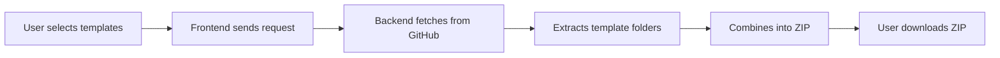

# 🚀 Zero-Config Full-Stack Starter Generator

**Instantly generate production-ready full-stack projects without manual setup!**

A powerful web-based generator that creates fully configured full-stack projects with TypeScript, authentication, and best practices — all in one click. Supports React, Angular, Vue.js, Next.js, Express.js, NestJS, and Spring Boot.


---

## 🎯 What Is This?

**Zero-Config** eliminates the tedious hours spent setting up boilerplate code for full-stack projects. Instead of manually configuring TypeScript, bundlers, databases, authentication, and folder structures, simply: 

1. **Select** your frontend framework (React, Angular, Vue.js, or Next.js)
2. **Select** your backend framework (Express.js, NestJS, or Spring Boot)
3. **Download** a fully configured, production-ready project
4. **Start coding** immediately! 

Perfect for: 
- 🚀 Rapid prototyping
- 📚 Learning full-stack development
- 🏗️ Bootstrapping new projects
- 🎓 Teaching and tutorials
- 🏆 Hackathons and MVPs
- 🏢 Enterprise applications

---

## ✨ Available Stack Combinations

### 🎨 **Frontend Options**

#### ⚛️ **React v19 + Vite**
- Modern React 19 with Vite 7.2 bundler
- TypeScript 5.9 for type safety
- JWT authentication with Context API
- Protected routes with React Router v6
- Automatic token refresh mechanism
- Tailwind CSS for styling
- Port: **5173**
- **Features:** Auth context, Protected routes, Token refresh
- **Technologies:** React 19, Vite 7.2, React Router v6, TypeScript 5.9, Tailwind CSS

#### 🅰️ **Angular v21 + SSR**
- Angular 21+ with Server-Side Rendering
- TypeScript strict mode
- Signal-based state management
- JWT authentication service
- HTTP interceptors for auth
- Angular Router with guards
- Tailwind CSS 4.x
- Vitest for unit testing
- Port: **4200**
- **Features:** Auth guards, Signals, Tailwind CSS 4
- **Technologies:** Angular 21, SSR, Signals, Tailwind CSS 4.x, Vitest, RxJS

#### 💚 **Vue.js v3 + Vite**
- Vue 3.5 with Composition API
- Pinia 3.0 for state management
- Vue Router 4.6 for routing
- Vite 7.3 bundler
- Oxlint for fast linting
- Tailwind CSS for styling
- Port: **5173**
- **Features:** Pinia store, Composition API, Oxlint
- **Technologies:** Vue 3.5, Pinia 3.0, Vue Router 4.6, Vite 7.3, Oxlint, Tailwind CSS

#### ▲ **Next.js v15 App Router (Full-Stack)**
- Next.js 15 with App Router
- SQLite database with built-in auth
- Server Actions for backend logic
- Full CRUD operations
- Tailwind CSS 4
- Complete full-stack solution
- Port: **3000**
- **Features:** SQLite auth, Server Actions, Full CRUD
- **Technologies:** Next.js 15, SQLite, Server Actions, Tailwind CSS 4

---

### 🔧 **Backend Options**

#### 🚀 **Express.js + MongoDB**
- Express 4.18 with TypeScript
- MongoDB with Mongoose 7 ODM
- JWT authentication (Access + Refresh tokens)
- In-memory MongoDB fallback for quick prototyping
- mongodb-memory-server for development
- RESTful API architecture
- CORS configured
- Environment variable support (.env)
- Protected routes middleware
- Password hashing with bcrypt
- Port: **5000**
- **Database:** MongoDB
- **ORM:** Mongoose
- **Features:** In-memory fallback, Auto-migration
- **Technologies:** Express 4.18, Mongoose 7, mongodb-memory-server, JWT, bcrypt

**API Endpoints:**
```
POST   /api/auth/register   - Register new user
POST   /api/auth/login      - Login and get tokens
POST   /api/auth/refresh    - Refresh access token
POST   /api/auth/logout     - Logout user
GET    /api/items           - Get all items (protected)
POST   /api/items           - Create item (protected)
DELETE /api/items/:id       - Delete item (protected)
```

#### 🐱 **NestJS + PostgreSQL + Prisma**
- NestJS 11+ with strict TypeScript
- PostgreSQL database
- Prisma 6.2 ORM for type-safe queries
- JWT authentication with token rotation
- Passport.js for authentication strategies
- HTTP-only cookies for refresh tokens
- Modular architecture (Auth, Users, Items)
- Class-validator for input validation
- Bcrypt password hashing
- CORS configuration
- Port: **5000**
- **Database:** PostgreSQL
- **ORM:** Prisma
- **Features:** Modular architecture, Passport.js
- **Technologies:** NestJS 11, Prisma 6.2, Passport.js, JWT, class-validator

**Features:**
- Token rotation on refresh
- Secure cookie-based refresh tokens
- Strong password validation
- Prisma migrations
- Prisma Studio for database management

#### 🍃 **Spring Boot + MySQL + JPA**
- Spring Boot 4.0.2 (Java 17+)
- MySQL database
- Spring Data JPA for ORM
- Spring Security for authentication
- JJWT 0.12 for JWT tokens
- Enterprise-grade architecture
- RESTful API design
- Dependency injection
- Maven build system
- Port: **8080**
- **Database:** MySQL
- **ORM:** JPA
- **Features:** Spring Security, Enterprise-grade
- **Technologies:** Spring Boot 4.0.2, Spring Security, JPA, JJWT 0.12, MySQL

---

## 🎨 Live Demo

**👉 [Try it now:  https://zero-config-mern-starter-generator.vercel.app](https://zero-config-mern-starter-generator.vercel.app)**


---

## 📦 What You Get

Each generated project includes:

### ✅ **Frontend (React)**
```
client/
├── src/
│   ├── components/
│   │   ├── Auth/         # Login & Register components
│   │   ├── Items/        # CRUD demo components
│   │   └── ProtectedRoute. tsx
│   ├── context/
│   │   └── AuthContext.tsx   # Authentication state
│   ├── services/
│   │   └── api. ts            # API client with interceptors
│   ├── App.tsx
│   └── main.tsx
├── index.html
├── vite.config.ts
├── tsconfig.json
├── package.json
└── . env. example
```

### ✅ **Frontend (Angular)**
```
angular/
├── src/
│   ├── app/
│   │   ├── components/
│   │   │   ├── auth/     # Login & Register
│   │   │   └── items/    # CRUD demo
│   │   ├── services/
│   │   │   ├── auth.service.ts
│   │   │   └── api.service.ts
│   │   ├── app.ts
│   │   └── app.routes.ts
│   └── index.html
├── angular.json
├── tsconfig.json
└── package.json
```

### ✅ **Frontend (Vue.js)**
```
vue/
├── src/
│   ├── components/
│   │   ├── Auth/         # Login & Register components
│   │   └── Items/        # CRUD demo components
│   ├── stores/
│   │   └── auth.ts       # Pinia auth store
│   ├── router/
│   │   └── index.ts      # Vue Router config
│   ├── services/
│   │   └── api.ts        # API client
│   ├── App.vue
│   └── main.ts
├── index.html
├── vite.config.ts
├── tsconfig.json
└── package.json
```

### ✅ **Backend (Express + MongoDB)**
```
server/
├── src/
│   ├── config/
│   │   └── db.ts         # MongoDB connection
│   ├── middleware/
│   │   └── auth.ts       # JWT middleware
│   ├── models/
│   │   ├── User.ts
│   │   └── Item.ts
│   ├── routes/
│   │   ├── auth.ts
│   │   └── items.ts
│   └── server.ts
├── tsconfig.json
├── package.json
└── . env.example
```

### ✅ **Backend (NestJS + PostgreSQL)**
```
nestjs/
├── src/
│   ├── auth/
│   │   ├── decorators/
│   │   ├── dto/
│   │   ├── guards/
│   │   ├── strategies/
│   │   ├── auth.controller.ts
│   │   ├── auth.service.ts
│   │   └── auth.module.ts
│   ├── items/
│   ├── users/
│   ├── prisma/
│   ├── app.module.ts
│   └── main.ts
├── prisma/
│   └── schema.prisma
├── tsconfig.json
├── package.json
└── . env.example
```

### ✅ **Backend (Spring Boot + MySQL)**
```
springboot/
├── src/
│   ├── main/
│   │   ├── java/com/zero/config/
│   │   │   ├── controller/
│   │   │   │   ├── AuthController.java
│   │   │   │   └── ItemController.java
│   │   │   ├── service/
│   │   │   │   ├── AuthService.java
│   │   │   │   └── ItemService.java
│   │   │   ├── repository/
│   │   │   │   ├── UserRepository.java
│   │   │   │   └── ItemRepository.java
│   │   │   ├── model/
│   │   │   │   ├── User.java
│   │   │   │   └── Item.java
│   │   │   ├── security/
│   │   │   │   └── JwtAuthenticationFilter.java
│   │   │   └── Application.java
│   │   └── resources/
│   │       └── application.properties
│   └── test/
├── pom.xml
└── mvnw
```

---

## 📋 Prerequisites

Before using Zero-Config templates, ensure you have the following installed:

### **For All Templates:**
- **Node.js** v18 or higher ([Download](https://nodejs.org/))
- **npm** or **yarn** package manager (comes with Node.js)
- **Git** (optional, for version control)

### **For Spring Boot Template:**
- **Java Development Kit (JDK)** 17 or higher ([Download](https://www.oracle.com/java/technologies/downloads/))
- **Maven** 3.6+ ([Download](https://maven.apache.org/download.cgi)) or use the included Maven Wrapper

### **For Database Templates:**
- **MongoDB** (for Express template) - Or use the built-in in-memory server
- **PostgreSQL** (for NestJS template) - [Download](https://www.postgresql.org/download/)
- **MySQL** (for Spring Boot template) - [Download](https://dev.mysql.com/downloads/)

### **Recommended Tools:**
- **VS Code** with extensions for your chosen framework
- **Postman** or **Thunder Client** for API testing
- **Docker** (optional, for containerized databases)

---

## 🚀 Quick Start (Using the Generator)

### 1️⃣ **Generate Your Project**

Visit **[https://zero-config-mern-starter-generator.vercel.app](https://zero-config-mern-starter-generator.vercel.app)**

1. Select your **frontend** (React, Angular, Vue.js, or Next.js)
2. Select your **backend** (Express, NestJS, or Spring Boot)
3. Click **"Download Stack"**
4. **IMPORTANT (Windows users):** Right-click the ZIP → Properties → Check "Unblock" → Apply

### 2️⃣ **Extract & Install**

```bash
# Extract the downloaded ZIP file
unzip react-express-stack.zip
cd react-express-stack

# Install backend dependencies
cd express  # or nestjs, or springboot
npm install # For Express/NestJS
# OR
mvn install # For Spring Boot

# Install frontend dependencies (in new terminal)
cd react    # or angular, or vue
npm install
```

### 3️⃣ **Configure Environment**

**For Express + MongoDB:**
```bash
cd express
cp .env.example .env
# Edit .env with your MongoDB URI (or leave blank for in-memory DB)
```

**For NestJS + PostgreSQL:**
```bash
cd nestjs
cp .env.example .env
# Edit .env with your PostgreSQL connection string
npx prisma generate
npx prisma migrate dev --name init
```

**For Spring Boot + MySQL:**
```bash
cd springboot
cp application.properties.example src/main/resources/application.properties
# Edit application.properties with your MySQL connection details
```

### 4️⃣ **Run Your Project**

**Backend:**
```bash
# Express or NestJS
cd express  # or nestjs
npm run dev
# Server runs on http://localhost:5000

# Spring Boot
cd springboot
mvn spring-boot:run
# Server runs on http://localhost:8080
```

**Frontend:**
```bash
cd react    # or angular, or vue
npm run dev
# React/Vue: http://localhost:5173
# Angular: http://localhost:4200
```

**Next.js (Full-Stack):**
```bash
cd nextjs
npm install
npm run dev
# App runs on http://localhost:3000
```

### 5️⃣ **Start Building!  🎉**

Your full-stack app is now running with authentication, CRUD operations, and TypeScript support!

---

## 🛠️ Running the Generator Locally

Want to run the generator on your own machine? 

```bash
# Clone the repository
git clone https://github.com/dhuruvandb/zero-config. git
cd zero-config

# Install backend dependencies
cd Backend
npm install

# Build TypeScript
npm run build

# Start the backend generator
npm start
# Server runs on http://localhost:8000

# Open index.html in your browser (from the root directory)
# Make sure to update the API URL in index.html if needed
```

---

## 🔧 Generator Architecture

### **How It Works**


```mermaid
graph LR
    A[User selects templates] --> B[Frontend sends request]
    B --> C[Backend fetches from GitHub]
    C --> D[Extracts template folders]
    D --> E[Combines into ZIP]
    E --> F[User downloads ZIP]
```

1. **Frontend (index.html):** Beautiful UI for template selection
2. **Backend (Express + TypeScript):** 
   - Fetches templates from [zero-config-templates](https://github.com/dhuruvandb/zero-config-templates) repo
   - Extracts and combines selected templates
   - Generates downloadable ZIP file
3. **Templates Repository:** Stores all boilerplate code

### **Backend API Endpoints**

```
GET  /api/templates              - List available templates
POST /api/templates              - Download selected template combo
GET  /api/generate-template/: id  - Download single template
```

---

## 🎓 What's Included in Each Template

### **Common Features (All Templates)**
- ✅ **100% TypeScript** - Full type safety across the stack
- ✅ **JWT Authentication** - Access tokens (15 min expiry) + Refresh tokens (7 day expiry)
- ✅ **Token Rotation** - Automatic token refresh on expiry
- ✅ **Strong Password Requirements** - Min 8 chars, uppercase, lowercase, number, special char
- ✅ **bcrypt Password Hashing** - 10 rounds for security
- ✅ **User Registration & Login** - Complete authentication flow
- ✅ **Protected Routes** - Secure endpoints/pages
- ✅ **CRUD Operations Demo** - Full create, read, update, delete examples
- ✅ **Environment Variables** - Easy configuration with .env files
- ✅ **Error Handling** - Comprehensive error management
- ✅ **CORS Configured** - Frontend-backend communication ready
- ✅ **Production-Ready Structure** - Best practices and patterns
- ✅ **Hot Module Replacement** - Fast development workflow

### **React Template Extras**
- Context API for state management
- React Router v6 for navigation
- Axios with interceptors
- Automatic token refresh
- Loading states and error boundaries
- Tailwind CSS for styling

### **Angular Template Extras**
- Signal-based state management
- HTTP interceptors for auth
- Route guards for protection
- Standalone components (no NgModules)
- Dependency injection
- Vitest testing setup
- Server-Side Rendering (SSR)
- Tailwind CSS 4.x

### **Vue.js Template Extras**
- Pinia store for state management
- Composition API
- Vue Router for navigation
- Oxlint for fast linting
- Script setup syntax
- Tailwind CSS for styling
- Reactive refs and computed properties

### **Next.js Template Extras**
- App Router architecture
- Server Actions for backend logic
- SQLite database included
- Server and Client Components
- Built-in API routes
- No separate backend needed
- Tailwind CSS 4

### **Express Template Extras**
- Mongoose schemas and models
- MongoDB in-memory server fallback
- Middleware authentication
- Password hashing with bcrypt
- RESTful API design
- Environment-based configuration

### **NestJS Template Extras**
- Prisma ORM with type safety
- PostgreSQL database
- Modular architecture (decorators)
- DTOs with class-validator
- HTTP-only cookies for refresh tokens
- Token rotation mechanism
- Passport.js strategies
- Prisma Studio for database management

### **Spring Boot Template Extras**
- Spring Security configuration
- Spring Data JPA repositories
- MySQL database integration
- Bean-based dependency injection
- Maven build system
- Enterprise-grade architecture
- RESTful controllers
- JJWT for JWT handling

---

## 📚 Use Cases & Recommended Stack Combinations

| Use Case | Recommended Stack | Why? |
|----------|-------------------|------|
| **Rapid Prototyping** | React + Express (in-memory DB) | Fast setup, JavaScript-focused, quick iterations |
| **Enterprise Apps** | Angular + NestJS + PostgreSQL | Large-scale, strict type safety, modular architecture |
| **Full-Stack Serverless** | Next.js (Standalone) | Single deployment unit, serverless-ready, unified codebase |
| **Modern Progressive Web App** | Vue.js + Express | Modern reactive framework, progressive enhancement |
| **Java Enterprise** | Angular/React + Spring Boot + MySQL | Enterprise ecosystem, established patterns, Java stack |
| **Learning Full-Stack** | React + Express | Beginner-friendly, consistent JavaScript, gentle learning curve |
| **Scalable Backend** | Any Frontend + NestJS | Type-safe ORM, modular design, excellent scalability |
| **Quick MVPs** | Next.js OR React + Express | Fastest time to market, minimal configuration |
| **Production-Grade** | Angular + NestJS OR Spring Boot | Battle-tested, enterprise support, comprehensive features |

### 🎯 **Popular Stack Combinations**

1. **MERN Stack** (React + Express + MongoDB)
   - Best for: Rapid prototyping, JavaScript-focused teams
   - Setup time: ~5 minutes
   - Learning curve: Low to Medium

2. **Enterprise Stack** (Angular + NestJS + PostgreSQL)
   - Best for: Large-scale applications, strict type safety
   - Setup time: ~10 minutes
   - Learning curve: Medium to High

3. **Full-Stack Next.js** (Next.js v15 Standalone)
   - Best for: Serverless deployments, single deployment unit
   - Setup time: ~5 minutes
   - Learning curve: Medium

4. **Vue Stack** (Vue.js + Express + MongoDB)
   - Best for: Modern progressive framework with reactive state
   - Setup time: ~5 minutes
   - Learning curve: Low to Medium

5. **Java Enterprise** (Spring Boot + Any Frontend)
   - Best for: Enterprise applications, Java ecosystem
   - Setup time: ~10-15 minutes
   - Learning curve: High

---

## 🤝 Contributing

We welcome contributions! Here's how: 

1. Fork the repository
2. Create a feature branch (`git checkout -b feature/amazing-feature`)
3. Commit your changes (`git commit -m 'Add amazing feature'`)
4. Push to the branch (`git push origin feature/amazing-feature`)
5. Open a Pull Request

**Ideas for contributions:**
- 🎨 Add new templates (Svelte, FastAPI, Django, Go, Rust)
- 🔧 Add customization options (project name, ports, database selection)
- 📝 Improve documentation
- 🐛 Fix bugs
- ✨ Enhance UI/UX
- 🧪 Add more test coverage
- 🔐 Improve security features

---

## 📝 Roadmap

- [x] Add Vue.js + Vite template
- [x] Add Spring Boot backend option
- [x] Update to React 19
- [x] Update to Angular 21 with SSR
- [x] Update to Next.js 15 with App Router
- [x] Add comprehensive template information
- [ ] Add Svelte template
- [ ] Add FastAPI backend option
- [ ] Add Django backend option
- [ ] Project name customization
- [ ] Port configuration
- [ ] Database connection string generator
- [ ] CLI tool (`npx zero-config create my-app`)
- [ ] Template preview feature
- [ ] GitHub Actions CI/CD templates
- [ ] Docker configuration option
- [ ] Kubernetes manifests option

---

## 🐛 Known Issues

- **Windows ZIP Block:** Windows may block files in the ZIP.  **Solution:** Right-click ZIP → Properties → Unblock
- **CORS in Production:** Update frontend API URLs for production deployment

---

## 📄 License

This project is licensed under the **MIT License** - see the [LICENSE](LICENSE) file for details.

---

## 🙏 Acknowledgments

- **React Team** - For the amazing frontend library
- **Angular Team** - For the powerful framework
- **NestJS Team** - For the elegant backend framework
- **Vercel** - For free hosting
- **MongoDB** - For the flexible database
- **PostgreSQL** - For the robust RDBMS
- **Prisma** - For type-safe database access

---

## 📬 Contact & Support

- **Author:** [@dhuruvandb](https://github.com/dhuruvandb)
- **Live Demo:** [zero-config-mern-starter-generator.vercel. app](https://zero-config-mern-starter-generator.vercel.app)
- **Issues:** [GitHub Issues](https://github.com/dhuruvandb/zero-config/issues)
- **Template Source:** [zero-config-templates](https://github.com/dhuruvandb/zero-config-templates)

---

## 🌟 Show Your Support

If this project helped you, give it a ⭐️!  It motivates me to build more awesome tools. 

---

## 💡 Why Zero-Config?

**Before:**
```bash
# 2+ hours of setup
npx create-react-app client
cd client && npm install axios react-router-dom
# Configure TypeScript... 
# Setup authentication...
# Create backend...
# Install Express, MongoDB...
# Configure JWT...
# Setup CORS...
# ... many more steps
```

**After:**
```bash
# 2 minutes
1. Click button
2. Download ZIP
3. Extract & npm install
4. npm run dev
# ✅ Done!
```

---

<div align="center">

### 🚀 **Build your project faster.  Zero config. Zero headaches.  Just code.**

Made with ❤️ by [dhuruvandb](https://github.com/dhuruvandb)

[⬆ Back to top](#-zero-config-full-stack-starter-generator)

</div>
